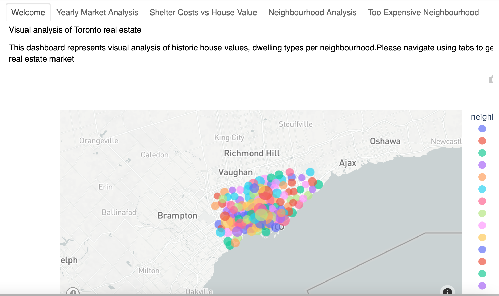
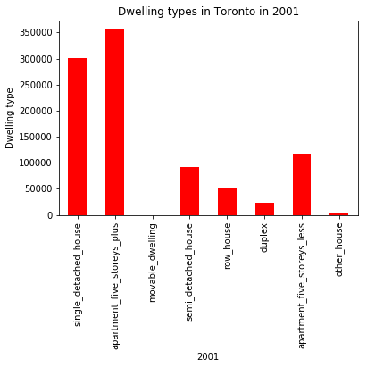
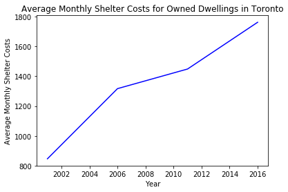
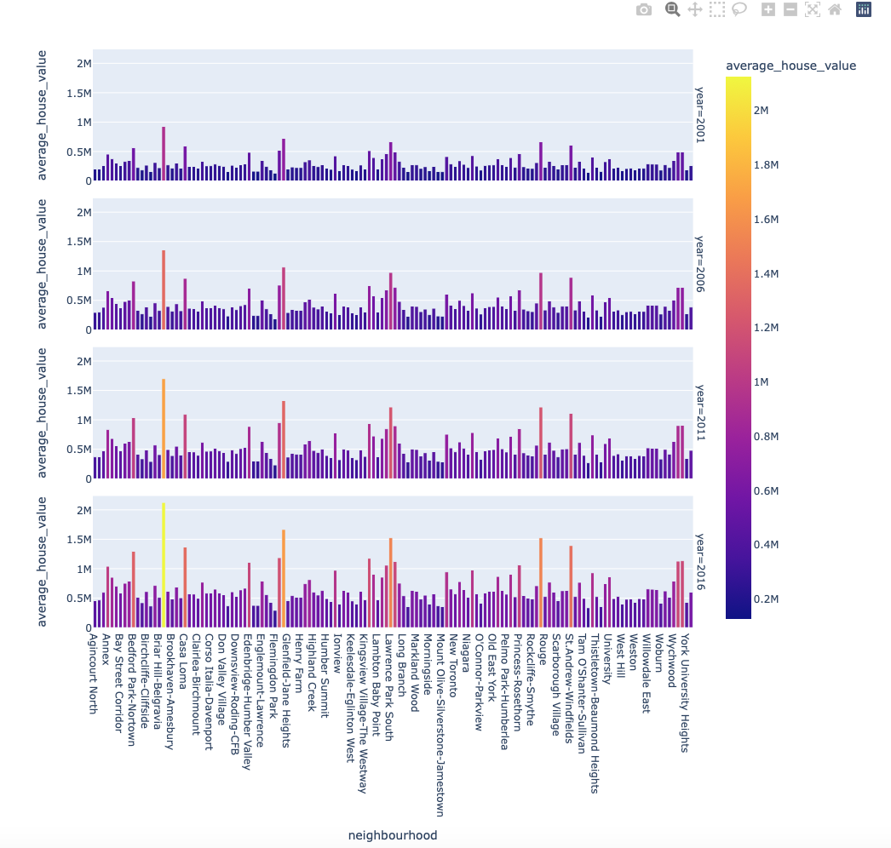
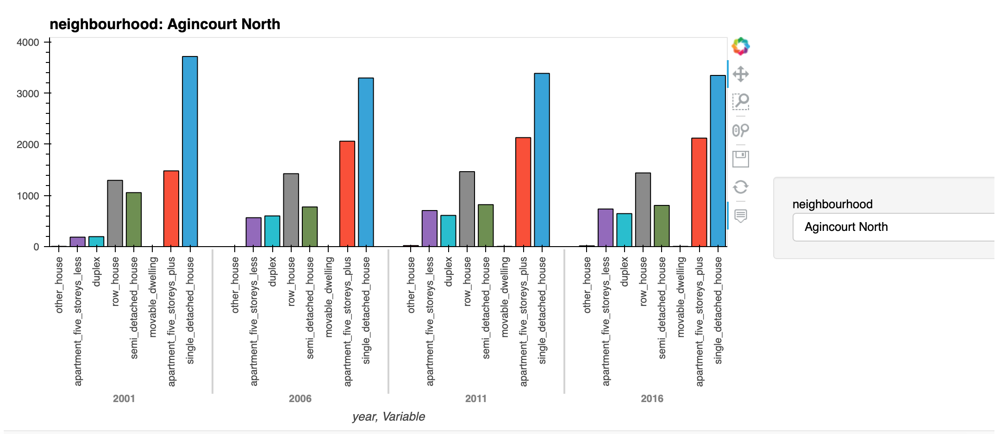
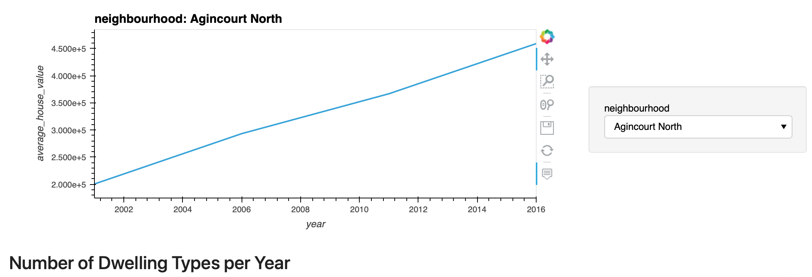
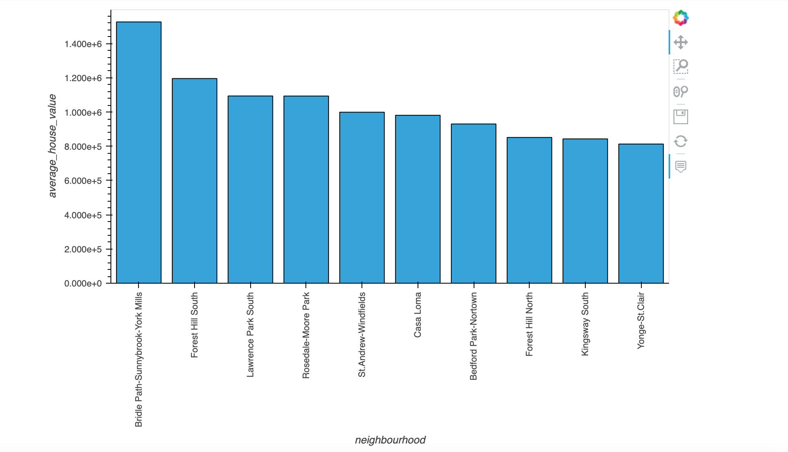
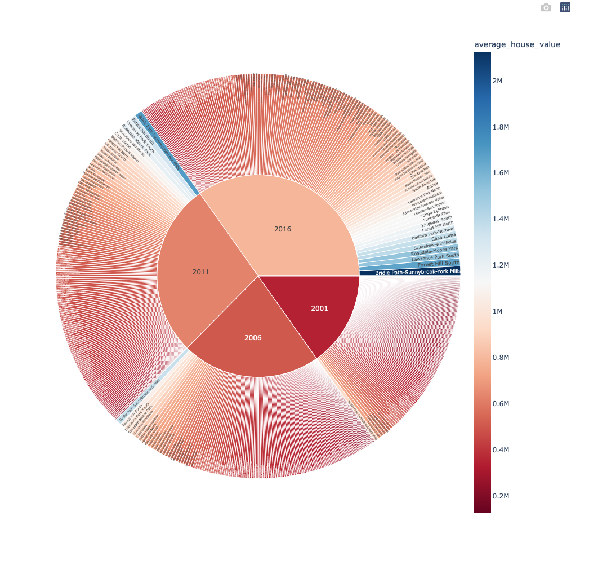

# 06_Pythonic_Monopoly

***This homework loads the data from csv files to a dataframe and then different
aggregation functions like groupby/sum/mean etc to get the required data***

***It then plots the data using bar charts/line charts/hvplots for interactive data visualization***

This dashboard's goal is to provide charts, maps, and interactive visualizations that help customers explore the data 

***The dashboard has 5 tabs that display the data as below***

***Welcome tab*** 
This tab represents visual analysis of historic house values, dwelling types per neighbourhood using scatter_mapbox based on the longitude and latitude of the house location

***Yearly market analysis*** 
This tab has 4 bar charts for 4 years that show different types of dwelling types sold for that year

***Shelter Cost vs House Value*** 
This tab has 3 line charts. First 2 charts show shelter costs for owned and rented dwellings in Toronto. Last chart shows average house value over a period of time

***Neighbourhood Analysis***
Average house values for different years
Interactive bar chart where user can select a neighbourhood and get dwelling types for different years
Interactive chart where user can select a neighbourhoood and get average house value for that neighbourhood

***Too Expensive neighbourhood***

- A bar char for the top 10 expensive neighbourhood
- A sun chart for all the neighhourhood with colors indicating the cost and can be viewed for different years

# The following images show the differnent types of charts that are being rendered

***Bar charts***

***Line charts***

***Bar charts using hvplot***

***Interactive Bar charts using hvplot***

***Interactive Line charts using hvplot***

***Interactive Bar charts***

***SunBurst charts***

